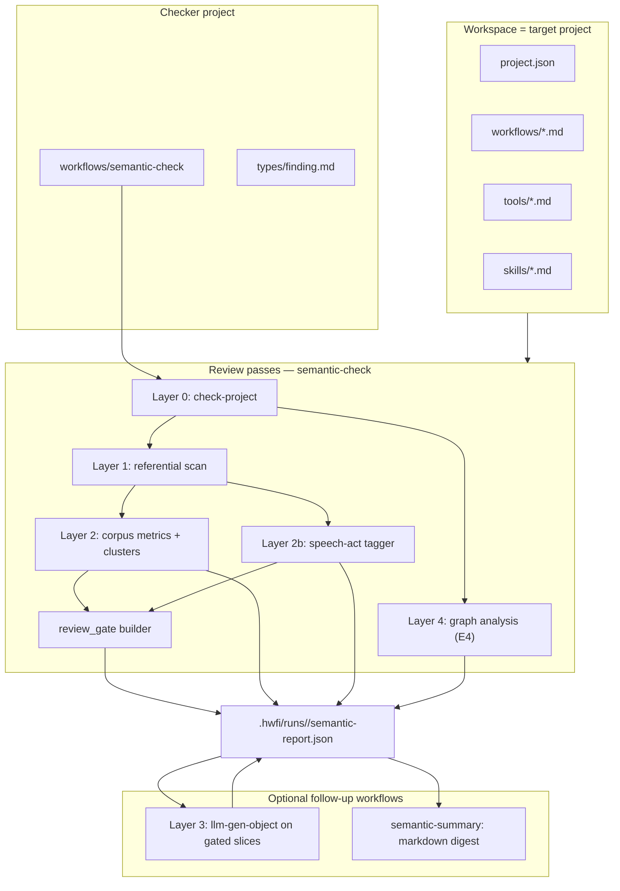

# Semantic review — design notes

Companion to spec §13.1.8. Tier 1–2 builtins, `examples/semantic-check` layers
0–3, and `examples/semantic-summary` are **implemented**. **Architecture
cleanup** (split check from optional LLM) is the active backlog; **E4** graph
layer follows. See [Architecture cleanup](#architecture-cleanup),
[Implementation phases](#implementation-phases), and [Experimental
track](#experimental-track).

## Problem

`hwfi check` answers a decidable question: does this project have the right
shapes and wiring? That is the analogue of a static type system for
workflow *structure*.

Authors also need to ask a different question: do the **meanings** in system
prompts, agent sections, skill prose, and step descriptions cohere? Do they
reference tools that exist? Do two agents contradict each other? Is guidance
duplicated or unnecessarily noisy?

This is not a compiler phase. It is closer to a **linter plus design
reviewer** — findings with severity, evidence, and location — and it should
remain **opinionated, versioned, and replaceable**.

## Design principles

1. **Workflow, not engine.** Semantic review is an ordinary hwfi workflow (e.g.
   `examples/semantic-check`). It is never invoked automatically by `hwfi
   check` or `hwfi run`.

2. **Workspace = project under review.** The checker workflow runs from its
   own project directory; the **workspace** points at the target project root.
   Existing file builtins (`read-file`, `grep`, …) read target artifacts from
   the workspace. No reads outside the workspace.

3. **Layered analysis.** Mechanical passes first (cheap, deterministic); LLM
   passes only on extracted slices. See [Analysis layers](#analysis-layers).

4. **General-purpose builtins.** The engine exposes primitives (parse, metrics,
   graphs, similarity). Review *policy* (categories, thresholds, prompts) lives
   in the checker workflow.

5. **Recoverable failures.** Parse/check builtins return `{ ok, …, error }`
   shapes (like `json-get` and `eval-workflow`) so scripted steps and agents
   can branch without aborting the review run.

6. **Non-determinism is explicit.** LLM-based findings may vary between runs.
   The workflow should use `llm-gen-object` with a fixed schema, low temperature,
   and optional strict vs exploratory modes.

## Architecture



**Invocation (today):**

```bash
# Deterministic check (+ optional layer 3 when mode=exploratory)
cabal run hwfi -- run examples/semantic-check \
  --workspace /path/to/target-project \
  --input path=. \
  --input entry=workflows/main

# Markdown digest of a prior check run
cabal run hwfi -- run examples/semantic-summary \
  --workspace /path/to/target-project \
  --input source_run=<run-id> \
  --input mode=mechanical
```

**Target invocation (after architecture cleanup):** check is always strict and
always emits `review_gate`; layer 3 runs only via a separate pragmatic workflow.
See [Architecture cleanup](#architecture-cleanup).

Layers 0–2b run without API keys. Layer 3 (today: `mode=exploratory` on check;
target: separate workflow) requires a model catalog.

## Analysis layers

| Layer | Question | Decidable? | Primary builtins |
|-------|----------|------------|------------------|
| 0 — Structure | Types, imports, call graph, tool lists | Yes | `check-project` |
| 1 — Referential prose | Qnames, `@self#` sections, model names in text | Mostly | `resolve-qnames-in-text`, `parse-markdown` |
| 2 — Corpus quality | Duplication, redundancy, noise | Heuristic | `text-metrics`, `text-similarity`, `text-search-corpus` |
| 2b — Speech acts | Directive/assertive mix, step↔agent alignment | Heuristic | Workflow pattern tagger on `parse-markdown` slices |
| 3 — Pragmatics | Contradictions, vague directives, felicity | No | `llm-gen-object` on **gated** slices only (workflow policy) |
| 4 — Graph | Import cycles, unreachable callees, orphan declarations | Yes | `graph-*` on `check-project` output |

**Speech act theory** and **entropy** inform layers 2–3 vocabulary and
heuristics; they do not define a sound type system. High entropy is not
inherently bad — treat metrics as **signals**, not verdicts. Layer 3 LLM runs
only on slices flagged by layer 2 / 2b gates.

## Experimental track

Research direction: use **information-theoretic** and **pragmatic-linguistic**
signals to prioritize human-style design review, without baking policy into the
engine.

### Entropy and corpus metrics (layer 2)

For each prose slice (agent section, tool description, skill body):

1. `parse-markdown` → section `body` strings.
2. `text-metrics` per slice → profile row (`shannon_entropy`, `compression_ratio`, token counts).
3. `text-search-corpus` + `text-similarity` across slices → duplication / near-duplicate clusters.

**Finding rules (workflow policy, tunable):**

| Signal | Interpretation | Suggested category |
|--------|----------------|-------------------|
| Entropy outlier within same `kind` (all agent sections) | Unusual information density — inspect | `ambiguity` (info) |
| High similarity + high compression in two sections | Literal or phrasing redundancy | `redundancy` |
| High similarity + divergent entropy | Same topic, different wording — contradiction candidate | gate → layer 3 |
| Compression ratio very high within one section | Repetitive boilerplate | `redundancy` (info) |

Workflow tools: `corpus-profile`, `corpus-clusters`, `corpus-hints`.

### Speech act heuristics (layer 2b)

Lightweight **illocutionary force** tagging before any LLM call. Pattern-based
(not NLP model); reproducible and cheap.

| Force | Typical patterns | Review question |
|-------|------------------|-----------------|
| Directive | imperatives, “must”, “always”, “never”, “do not” | Is there a verifiable condition? |
| Assertive | “is/are”, “the workspace contains”, factual claims | Checkable against layer 0/1? |
| Commissive | “you will”, “I will ensure” | Does the agent control this? |
| Declarative | “consider yourself authorized”, role assignment | Allowed by workflow policy? |

**Cross-artifact alignment** (uses `check-project` step metadata):

- Step advertises tools / callee → agent section should contain matching **directives**.
- Two agent sections both **direct** the same action differently → `contradiction` candidate.
- Tool description **declarative** scope exceeds what steps actually invoke → `policy` hint.

Workflow tools: `speech-act-scan`, `speech-act-align`.

### Gated pragmatics (layer 3)

High-signal gates feed `llm-gen-object` on **bounded slices** only (max 8).
Entropy/compression outliers and unguarded-directive hints are **excluded** from
layer 3 — they remain layer-2 info signals.

Gate priority (first wins per slice id):

1. Redundancy clusters (`check_redundancy` — both member bodies in prompt).
2. Cluster divergence pairs (`check_contradiction`).
3. Speech-act coverage gaps (`check_coverage_gap`).
4. Dead-reference prose warnings (`check_dead_reference`).

Prompt puts slice bodies first; `review_task` + `context` are selection metadata,
not prose under review. `pragmatic-filter-findings` drops felicity strings that
repeat layer-2 trigger boilerplate (e.g. Shannon entropy outlier claims).

Suggested LLM output fields (workflow schema, not engine):

```json
{
  "illocutionary_force": "directive",
  "felicity_violations": ["missing condition on retry directive"],
  "contradictions": [{ "other_location": "…", "evidence": "…" }],
  "clarity_score": 0.72
}
```

Map to `types/finding` (`contradiction`, `ambiguity`, `policy`). Today layer 3
is toggled by `mode=exploratory` on `semantic-check`; after architecture cleanup
it runs only in a separate pragmatic workflow. Low temperature; findings may
vary between runs — document in report metadata.

Workflow tools: `review-gate`, `pragmatic-review`. Depends on `split-text` for
sentence-level tagging when paragraph split is too coarse.

## Architecture cleanup

**Status:** next ([TASKS.md](TASKS.md)).

Today `semantic-check` couples deterministic review with optional layer 3 via
`mode=strict|exploratory`. Strict mode skips `review_gate` computation entirely,
so the report does not list which slices *would* be reviewed. Layer 3 and the
markdown summary are separate concerns but both depend on the same run directory.

**Problems:**

| Issue | Today | Target |
|-------|-------|--------|
| Gate visibility | `review_gate` only when `mode=exploratory` | Always emitted on check |
| LLM coupling | Layer 3 inside `semantic-check` | Separate optional workflow |
| Mode confusion | `strict` / `exploratory` / typo `explanatory` | Check always deterministic; LLM is explicit second step |
| Summary scope | `semantic-summary` digests existing report | Unchanged; runs after check (and optional pragmatic) |

**Target pipeline:**

```text
semantic-check          → semantic-report.json (+ review_gate always)
  ↓ optional
semantic-pragmatic      → merges pragmatic_findings into same run dir
  ↓ optional
semantic-summary        → semantic-summary.md (mechanical or narrative)
```

**Planned changes:**

1. **`semantic-check`** — layers 0–2b only; drop `mode` input; always compute
   and emit `review_gate`; report `mode` reflects deterministic check only.
2. **`semantic-pragmatic`** (new example project) — `--input source_run=<run-id>`;
   load report, run bounded `llm-gen-object` on `review_gate` items, write back
   `pragmatic_findings` (reuse existing gate/review tools).
3. **`semantic-summary`** — unchanged contract; document pipeline order in
   READMEs.

E4 graph findings remain after this cleanup; graph analysis stays in check.

## Findings schema (workflow-defined)

The checker workflow owns the output schema. Suggested starting shape:

```json
{
  "severity": "error | warning | info",
  "category": "dead_reference | contradiction | redundancy | ambiguity | policy | coverage_gap",
  "location": { "file": "workflows/plan.md", "section": "agent#planner" },
  "claim": "Prompt mentions builtin/http-fetch",
  "evidence": "…snippet…",
  "suggestion": "Import builtin/http-fetch or remove the mention"
}
```

Emit via `write-file` into the active run directory (e.g.
`.hwfi/runs/<run-id>/semantic-report.json`).

### Report schema versions

**v0 (current)** — layers 0–1 only:

`structural_errors`, `structural_warnings`, `entry_findings`, `prose_hints`,
`step_referential`.

**v1 (current)** — adds corpus and speech-act signals:

| Field | Layer | Content |
|-------|-------|---------|
| `corpus_profile` | 2 | List of per-slice metric rows (not findings) |
| `corpus_hints` | 2 | Redundancy / outlier findings |
| `speech_act_hints` | 2b | Act tag summaries and alignment mismatches |
| `pragmatic_findings` | 3 | LLM judgments (exploratory mode only) |
| `graph_findings` | 4 | Cycles, orphans, unreachable nodes |

Keep v0 fields unchanged for backward compatibility within the checker project.

## Planned builtins

Signatures follow §6 naming. **Implemented:** Tier 1, Tier 2,
`resolve-qnames-in-text`, `list-concat`. **Remaining:** graph Tier 3,
Tier 4 convenience (`split-text` prioritized for E3).

### Tier 1 — project and markdown structure

#### `builtin/check-project`

Parse and type-check a project directory (same pure checker as `hwfi check`),
returning structured metadata for review workflows.

```
{ path: FileRef } ->
{ ok: Bool,
  errors: List<String>,
  warnings: List<String>,
  declarations: List<DeclarationSummary>,
  call_graph: Json,
  error: String }
```

`DeclarationSummary` (record fields):

| Field | Type | Notes |
|-------|------|-------|
| `qname` | `String` | e.g. `workflows/plan` |
| `kind` | `String` | `workflow` \| `tool` \| `skill-callable` \| `skill-instruction` \| `type` |
| `path` | `String` | Source file relative to project root |
| `inputs` | `Json` | Resolved input record type as JSON |
| `outputs` | `Json` | Resolved output record type as JSON |
| `imports` | `List<String>` | Declared import qnames |
| `agent_sections` | `List<String>` | `@self#slug` names in this file |
| `steps` | `List<StepSummary>` | Per-step metadata |

`StepSummary`:

| Field | Type | Notes |
|-------|------|-------|
| `step_id` | `String` | `@suffix` or synthetic id |
| `target` | `String` | Callee qname |
| `agent_tools` | `List<String>` | Static tool list when target is `llm-agent*` |
| `interpolations` | `List<String>` | `${…}` ref paths in step args |
| `bare_qnames` | `List<String>` | Qname literals in expressions |

- `path` is relative to the **workspace** root (the target project).
- `ok = false` when parse or type-check fails; `errors` mirrors CLI
  diagnostics; `declarations` may be partial.
- **Cacheable** when `path` is a stable project tree inside the workspace.
- **Not agent-eligible** (large structured dump).

**Rationale:** The semantic checker's "AST API". Avoids `exec(hwfi check)` stderr
parsing and duplicated markdown regex logic.

#### `builtin/parse-markdown`

Extract structure from a markdown file without workflow-specific knowledge.

```
{ path: FileRef,
  sections: Bool,
  frontmatter: Bool,
  fences: Bool } ->
{ ok: Bool,
  frontmatter: Json,
  sections: List<MarkdownSection>,
  fences: List<MarkdownFence>,
  error: String }
```

`MarkdownSection`: `{ level: Int, title: String, slug: String, body: String }`

- `slug` — heading text lowercased, non-word runs → `-` (same rules as
  `@self#` slugs where applicable).
- `MarkdownFence`: `{ lang: String, body: String }`.
- Empty `frontmatter` → `{}` when `frontmatter = false` or absent.
- **Cacheable** for workspace files.

**Rationale:** Shared primitive for review, skill extraction, and doc tooling.

### Tier 2 — text corpus analysis

#### `builtin/text-metrics`

Deterministic statistics on a string (not a file path — use `read-file` first).

```
{ text: String,
  tokenize: String } ->
{ chars: Int,
  tokens: Int,
  lines: Int,
  paragraphs: Int,
  shannon_entropy: Float,
  compression_ratio: Float }
```

- `tokenize`: `"char"` \| `"word"` \| `"line"` — unit for entropy.
- `compression_ratio` — `len(text) / len(zlib.compress(text))`; cheap
  redundancy proxy (not semantic similarity).
- **Cacheable.**

#### `builtin/text-similarity`

Pairwise similarity between two strings.

```
{ left: String,
  right: String,
  method: String,
  ngram: Int } ->
{ score: Float,
  method: String,
  left_tokens: Int,
  right_tokens: Int }
```

- `method`: `"jaccard"` (word or character n-grams) \| `"lcs"` (longest common
  substring ratio). Embedding cosine deferred to a later revision or
  `discover-skills` semantic follow-up.
- `ngram` default 3 for character mode, 1 for word mode.
- **Cacheable.**

#### `builtin/text-search-corpus`

Find overlap clusters across a document set.

```
{ documents: List<Record<{ id: String, text: String }>>,
  method: String,
  threshold: Float,
  ngram: Int } ->
{ clusters: List<Record<{ members: List<String>, score: Float, span: String }>> }
```

- `members` — document `id` values in the cluster.
- `span` — representative shared substring (longest common substring or
  highest-overlap n-gram window).
- **Cacheable** when document texts are stable.

### Tier 3 — graph and reference utilities

#### `builtin/graph-reachability`

```
{ nodes: List<String>,
  edges: List<Record<{ from: String, to: String }>>,
  start: String,
  direction: String } ->
{ reachable: List<String> }
```

- `direction`: `"out"` \| `"in"` \| `"both"`.

#### `builtin/graph-cycles`

```
{ nodes: List<String>,
  edges: List<Record<{ from: String, to: String }>> } ->
{ cycles: List<List<String>> }
```

- Each cycle is a node path (not necessarily simple minimum cycle basis).

#### `builtin/graph-topo-sort`

```
{ nodes: List<String>,
  edges: List<Record<{ from: String, to: String }>> } ->
{ ok: Bool,
  order: List<String>,
  error: String }
```

- `ok = false` when a cycle exists; `error` describes failure.

All three graph builtins: **cacheable**; inputs are pure JSON/data.

#### `builtin/resolve-qnames-in-text`

Classify qname-like mentions in arbitrary text against a project catalog.

```
{ text: String,
  catalog: List<String>,
  include_builtins: Bool } ->
{ mentions: List<Record<{ text: String, kind: String, qname: String }>> }
```

- `kind`: `resolved` \| `unresolved` \| `builtin` \| `ambiguous`.
- `catalog` — qnames from `check-project.declarations` (or manual list).
- Mention patterns: `workflows/foo`, `tools/bar`, `builtin/baz`, bare segments
  with configurable rules (implementation detail).
- **Cacheable.**

### Tier 4 — convenience

#### `builtin/diff-text`

```
{ left: String,
  right: String,
  granularity: String } ->
{ text: String,
  lines_added: Int,
  lines_removed: Int,
  lines_changed: Int }
```

- `granularity`: `"line"` \| `"word"`.
- `text` — unified diff or human-readable summary (exact format TBD at
  implementation).
- **Cacheable.**

#### `builtin/json-validate`

Validate a JSON value against a JSON Schema (same schema type as
`llm-gen-object`).

```
{ json: Json,
  schema: Json } ->
{ ok: Bool,
  errors: List<String> }
```

- **Cacheable.**

#### `builtin/split-text`

Chunk long prose for bounded LLM context windows.

```
{ text: String,
  max_chars: Int,
  overlap: Int,
  split_on: String } ->
{ chunks: List<String> }
```

- `split_on`: `"paragraph"` \| `"sentence"` \| `"char"`.
- `overlap` — characters repeated at chunk boundaries (≥ 0).
- **Cacheable.**

## Implementation phases

### Completed

| Phase | Deliverable | Status |
|-------|-------------|--------|
| **P0 — Docs** | This document, TASKS, spec §13.1.8 | done |
| **P1 — Tier 1** | `check-project`, `parse-markdown` | done |
| **P2 — Example v0** | `examples/semantic-check` layers 0–1 | done |
| **P3 — Tier 2** | `text-metrics`, `text-similarity`, `text-search-corpus` | done |
| **P4 partial** | `resolve-qnames-in-text`, `list-concat` | done |
| **E1 — Layer 2 wiring** | `corpus-profile`, `corpus-clusters`, `corpus-hints`; report v1 | done |
| **E2 — Speech acts** | `speech-act-scan`, `speech-act-align`; `speech_act_hints` | done |
| **E3 — Gated LLM** | `review-gate`, `pragmatic-review`, `split-text`; `pragmatic_findings` | done |
| **Summary** | `examples/semantic-summary`, `builtin/read-json`, `source_run` CLI | done |

### Active

| Phase | Deliverable | Depends on |
|-------|-------------|------------|
| **AC — Architecture cleanup** | Split check / pragmatic / summary; always emit `review_gate` | E3, Summary |
| **E4 — Graph layer** | `graph-*` builtins, `graph-findings` | P1, P2 |

AC is independently shippable; E4 may proceed after AC (no dependency on LLM
split). Defer `diff-text` and `json-validate` until a concrete workflow needs them.

After AC, deterministic check (layers 0–2b + `review_gate` + E4) remains usable
without API keys.

## Non-goals

- **`builtin/semantic-check`** or any review-specific builtin — policy stays in
  the workflow.
- **Engine hooks on `hwfi check`** — structural check remains separate.
- **Reading outside the workspace** — sandbox unchanged.
- **Embedding / vector index in v1** of this backlog — defer; substring and
  n-gram similarity first (aligns with §6.7 discover follow-up).

## Related docs

| Resource | Content |
|----------|---------|
| [spec.md](spec.md) §13.1.8 | Normative backlog pointer |
| [workflow-reference.md](workflow-reference.md) | Author-facing builtin summary |
| [TASKS.md](TASKS.md) | Implementation checklist |
| [skills-design.md](skills-design.md) | Skill catalog; dedup overlap with layer 2 |
