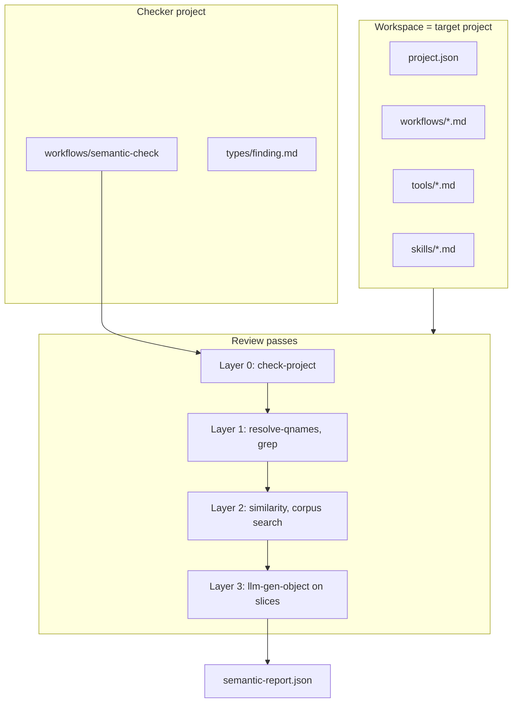

# Semantic review — design notes

Companion to spec §13.1.8. Planned builtins are **not implemented**; this
document captures the research direction and implementation backlog.

## Problem

`hwfi check` answers a decidable question: does this project have the right
shapes and wiring? That is the analogue of a static type system for
workflow *structure*.

Authors also need to ask a different question: do the **meanings** in system
prompts, agent sections, skill prose, and step descriptions cohere? Do they
reference tools that exist? Do two agents contradict each other? Is guidance
duplicated or unnecessarily noisy?

This is not a compiler phase. It is closer to a **linter plus design
reviewer** — findings with severity, evidence, and location — and it should
remain **opinionated, versioned, and replaceable**.

## Design principles

1. **Workflow, not engine.** Semantic review is an ordinary hwfi workflow (e.g.
   `examples/semantic-check`). It is never invoked automatically by `hwfi
   check` or `hwfi run`.

2. **Workspace = project under review.** The checker workflow runs from its
   own project directory; the **workspace** points at the target project root.
   Existing file builtins (`read-file`, `grep`, …) read target artifacts from
   the workspace. No reads outside the workspace.

3. **Layered analysis.** Mechanical passes first (cheap, deterministic); LLM
   passes only on extracted slices. See [Analysis layers](#analysis-layers).

4. **General-purpose builtins.** The engine exposes primitives (parse, metrics,
   graphs, similarity). Review *policy* (categories, thresholds, prompts) lives
   in the checker workflow.

5. **Recoverable failures.** Parse/check builtins return `{ ok, …, error }`
   shapes (like `json-get` and `eval-workflow`) so scripted steps and agents
   can branch without aborting the review run.

6. **Non-determinism is explicit.** LLM-based findings may vary between runs.
   The workflow should use `llm-gen-object` with a fixed schema, low temperature,
   and optional strict vs exploratory modes.

## Architecture



**Invocation (planned example):**

```bash
cabal run hwfi -- run examples/semantic-check \
  --workspace /path/to/target-project \
  --input entry=workflows/main
```

**v0 without new builtins:** `grep` + `read-file` + `exec(hwfi check .)` +
`llm-gen-object`. Works but brittle; Tier 1 builtins remove regex re-parsing.

## Analysis layers

| Layer | Question | Decidable? | Primary builtins |
|-------|----------|------------|------------------|
| 0 — Structure | Types, imports, call graph, tool lists | Yes | `check-project` |
| 1 — Referential prose | Qnames, `@self#` sections, model names in text | Mostly | `resolve-qnames-in-text`, `parse-markdown` |
| 2 — Corpus quality | Duplication, redundancy, noise | Heuristic | `text-metrics`, `text-similarity`, `text-search-corpus` |
| 3 — Pragmatics | Contradictions, vague directives, speech-act clarity | No | `llm-gen-object` (workflow policy) |
| 4 — Graph | Import cycles, unreachable callees, orphan declarations | Yes | `graph-*` on `check-project` output |

**Speech act theory** and **entropy** inform layer 3–4 vocabulary and
heuristics; they do not define a sound type system. High entropy is not
inherently bad — treat metrics as signals, not verdicts.

## Findings schema (workflow-defined)

The checker workflow owns the output schema. Suggested starting shape:

```json
{
  "severity": "error | warning | info",
  "category": "dead_reference | contradiction | redundancy | ambiguity | policy | coverage_gap",
  "location": { "file": "workflows/plan.md", "section": "agent#planner" },
  "claim": "Prompt mentions builtin/http-fetch",
  "evidence": "…snippet…",
  "suggestion": "Import builtin/http-fetch or remove the mention"
}
```

Emit via `write-file` or `llm-gen-object` into the workspace (e.g.
`semantic-report.json`).

## Planned builtins

All builtins below are **proposed**. Signatures follow §6 naming; cacheability
and agent-eligibility are design defaults subject to implementation review.

### Tier 1 — project and markdown structure

#### `builtin/check-project`

Parse and type-check a project directory (same pure checker as `hwfi check`),
returning structured metadata for review workflows.

```
{ path: FileRef } ->
{ ok: Bool,
  errors: List<String>,
  warnings: List<String>,
  declarations: List<DeclarationSummary>,
  call_graph: Json,
  error: String }
```

`DeclarationSummary` (record fields):

| Field | Type | Notes |
|-------|------|-------|
| `qname` | `String` | e.g. `workflows/plan` |
| `kind` | `String` | `workflow` \| `tool` \| `skill-callable` \| `skill-instruction` \| `type` |
| `path` | `String` | Source file relative to project root |
| `inputs` | `Json` | Resolved input record type as JSON |
| `outputs` | `Json` | Resolved output record type as JSON |
| `imports` | `List<String>` | Declared import qnames |
| `agent_sections` | `List<String>` | `@self#slug` names in this file |
| `steps` | `List<StepSummary>` | Per-step metadata |

`StepSummary`:

| Field | Type | Notes |
|-------|------|-------|
| `step_id` | `String` | `@suffix` or synthetic id |
| `target` | `String` | Callee qname |
| `agent_tools` | `List<String>` | Static tool list when target is `llm-agent*` |
| `interpolations` | `List<String>` | `${…}` ref paths in step args |
| `bare_qnames` | `List<String>` | Qname literals in expressions |

- `path` is relative to the **workspace** root (the target project).
- `ok = false` when parse or type-check fails; `errors` mirrors CLI
  diagnostics; `declarations` may be partial.
- **Cacheable** when `path` is a stable project tree inside the workspace.
- **Not agent-eligible** (large structured dump).

**Rationale:** The semantic checker's "AST API". Avoids `exec(hwfi check)` stderr
parsing and duplicated markdown regex logic.

#### `builtin/parse-markdown`

Extract structure from a markdown file without workflow-specific knowledge.

```
{ path: FileRef,
  sections: Bool,
  frontmatter: Bool,
  fences: Bool } ->
{ ok: Bool,
  frontmatter: Json,
  sections: List<MarkdownSection>,
  fences: List<MarkdownFence>,
  error: String }
```

`MarkdownSection`: `{ level: Int, title: String, slug: String, body: String }`

- `slug` — heading text lowercased, non-word runs → `-` (same rules as
  `@self#` slugs where applicable).
- `MarkdownFence`: `{ lang: String, body: String }`.
- Empty `frontmatter` → `{}` when `frontmatter = false` or absent.
- **Cacheable** for workspace files.

**Rationale:** Shared primitive for review, skill extraction, and doc tooling.

### Tier 2 — text corpus analysis

#### `builtin/text-metrics`

Deterministic statistics on a string (not a file path — use `read-file` first).

```
{ text: String,
  tokenize: String } ->
{ chars: Int,
  tokens: Int,
  lines: Int,
  paragraphs: Int,
  shannon_entropy: Float,
  compression_ratio: Float }
```

- `tokenize`: `"char"` \| `"word"` \| `"line"` — unit for entropy.
- `compression_ratio` — `len(text) / len(zlib.compress(text))`; cheap
  redundancy proxy (not semantic similarity).
- **Cacheable.**

#### `builtin/text-similarity`

Pairwise similarity between two strings.

```
{ left: String,
  right: String,
  method: String,
  ngram: Int } ->
{ score: Float,
  method: String,
  left_tokens: Int,
  right_tokens: Int }
```

- `method`: `"jaccard"` (word or character n-grams) \| `"lcs"` (longest common
  substring ratio). Embedding cosine deferred to a later revision or
  `discover-skills` semantic follow-up.
- `ngram` default 3 for character mode, 1 for word mode.
- **Cacheable.**

#### `builtin/text-search-corpus`

Find overlap clusters across a document set.

```
{ documents: List<Record<{ id: String, text: String }>>,
  method: String,
  threshold: Float,
  ngram: Int } ->
{ clusters: List<Record<{ members: List<String>, score: Float, span: String }>> }
```

- `members` — document `id` values in the cluster.
- `span` — representative shared substring (longest common substring or
  highest-overlap n-gram window).
- **Cacheable** when document texts are stable.

### Tier 3 — graph and reference utilities

#### `builtin/graph-reachability`

```
{ nodes: List<String>,
  edges: List<Record<{ from: String, to: String }>>,
  start: String,
  direction: String } ->
{ reachable: List<String> }
```

- `direction`: `"out"` \| `"in"` \| `"both"`.

#### `builtin/graph-cycles`

```
{ nodes: List<String>,
  edges: List<Record<{ from: String, to: String }>> } ->
{ cycles: List<List<String>> }
```

- Each cycle is a node path (not necessarily simple minimum cycle basis).

#### `builtin/graph-topo-sort`

```
{ nodes: List<String>,
  edges: List<Record<{ from: String, to: String }>> } ->
{ ok: Bool,
  order: List<String>,
  error: String }
```

- `ok = false` when a cycle exists; `error` describes failure.

All three graph builtins: **cacheable**; inputs are pure JSON/data.

#### `builtin/resolve-qnames-in-text`

Classify qname-like mentions in arbitrary text against a project catalog.

```
{ text: String,
  catalog: List<String>,
  include_builtins: Bool } ->
{ mentions: List<Record<{ text: String, kind: String, qname: String }>> }
```

- `kind`: `resolved` \| `unresolved` \| `builtin` \| `ambiguous`.
- `catalog` — qnames from `check-project.declarations` (or manual list).
- Mention patterns: `workflows/foo`, `tools/bar`, `builtin/baz`, bare segments
  with configurable rules (implementation detail).
- **Cacheable.**

### Tier 4 — convenience

#### `builtin/diff-text`

```
{ left: String,
  right: String,
  granularity: String } ->
{ text: String,
  lines_added: Int,
  lines_removed: Int,
  lines_changed: Int }
```

- `granularity`: `"line"` \| `"word"`.
- `text` — unified diff or human-readable summary (exact format TBD at
  implementation).
- **Cacheable.**

#### `builtin/json-validate`

Validate a JSON value against a JSON Schema (same schema type as
`llm-gen-object`).

```
{ json: Json,
  schema: Json } ->
{ ok: Bool,
  errors: List<String> }
```

- **Cacheable.**

#### `builtin/split-text`

Chunk long prose for bounded LLM context windows.

```
{ text: String,
  max_chars: Int,
  overlap: Int,
  split_on: String } ->
{ chunks: List<String> }
```

- `split_on`: `"paragraph"` \| `"sentence"` \| `"char"`.
- `overlap` — characters repeated at chunk boundaries (≥ 0).
- **Cacheable.**

## Implementation phases

| Phase | Deliverable | Depends on |
|-------|-------------|------------|
| **P0 — Docs** | This document, TASKS backlog, spec §13.1.8 | — |
| **P1 — Tier 1** | `check-project`, `parse-markdown` | Checker internals, markdown parser |
| **P2 — Example** | `examples/semantic-check` workflow (layers 0–1) | P1 |
| **P3 — Tier 2** | `text-metrics`, `text-similarity`, `text-search-corpus` | — |
| **P4 — Tier 3** | `graph-*`, `resolve-qnames-in-text` | P1 |
| **P5 — Tier 4** | `diff-text`, `json-validate`, `split-text` | — |
| **P6 — Full review** | Layer 3 LLM pass, findings report | P2–P5 |

Implement tiers in order; each tier is independently useful outside semantic
review (docs tooling, skill dedup, planner lint).

## Non-goals

- **`builtin/semantic-check`** or any review-specific builtin — policy stays in
  the workflow.
- **Engine hooks on `hwfi check`** — structural check remains separate.
- **Reading outside the workspace** — sandbox unchanged.
- **Embedding / vector index in v1** of this backlog — defer; substring and
  n-gram similarity first (aligns with §6.7 discover follow-up).

## Related docs

| Resource | Content |
|----------|---------|
| [spec.md](spec.md) §13.1.8 | Normative backlog pointer |
| [workflow-reference.md](workflow-reference.md) | Author-facing builtin summary |
| [TASKS.md](TASKS.md) | Implementation checklist |
| [skills-design.md](skills-design.md) | Skill catalog; dedup overlap with layer 2 |
