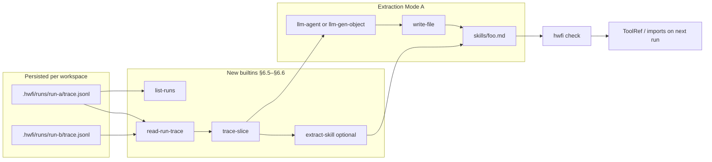

# Skills and cross-run traces — design notes

Companion to spec §6.5–§6.6. Acceptance criteria: A36–A40 in [spec.md](spec.md).

## Problem

Stage-2 goals from [idea.md](idea.md): agents should read execution traces,
learn from past runs, and materialize reusable **skills**. v1 shipped the
data model (`TraceEvent`, redaction, persistence) and dynamic evaluation
(`builtin/eval-workflow`, §6.4) but workflows could only see **the current
run** via `ctx.trace` / `builtin/introspect`.

## Design principles

1. **Skills are declarations, not a parallel runtime.** A skill is a normal
   tool or workflow file, usually under `skills/`, with optional provenance
   frontmatter. It goes through `hwfi check` like everything else.

2. **Cross-run access is explicit.** New builtins read `.hwfi/runs/` under
   the workspace sandbox — no implicit `ctx.prior_runs`.

3. **Agent-driven extraction first.** Mode A (trace slice → LLM →
   `write-file`) reuses eval-workflow, mutation tools, and existing agent
   loops. Mode B (`extract-skill`) is optional stub generation.

4. **Recoverable failures.** Missing runs and bad `run_id` values return
   `{ ok = false }` rather than aborting the enclosing workflow, matching
   §6.4.3.

## Architecture



## Mode A example flow

After a successful coding agent run (`examples/coding`), a separate
workflow could:

```step
runs <- builtin/list-runs(limit = 5)
# pick the latest completed run id from runs.runs ...
trace <- builtin/trace-slice(
  run_id = "...",
  qname = "workflows/fix",
  step_id = "agent",
  include_nested = true
)
draft <- tools/skill-writer(
  slice = "${trace.events}",
  kind = "tool",
  name = "skills/fix-shell-script"
)
_ <- builtin/write-file(path = "skills/fix-shell-script.md", text = "${draft.text}")
return { note = "wrote skill" }
```

Author runs `hwfi check`, commits `skills/fix-shell-script.md`, and adds
an import or `ToolRef` on the next agent invocation.

## What not to build in v1.1

- **Automatic skill registration** — no magic imports; explicit promotion.
- **Cross-workspace trace access** — out of scope.
- **Skill versioning / registry** — file path is the qname; Merkle
  fingerprints handle cache invalidation (§8.1).
- **LLM inside `extract-skill`** — use Mode A for summarization.
- **Cursor-style SKILL.md** — IDE concern, not hwfi product surface.

## Implementation map

| Task | Module touchpoints | Tests |
|------|-------------------|-------|
| 9.3 list-runs, read-run-trace | `RunStore`, `Builtins`, `Check/Builtins` | A36, A37 |
| 9.4.1 skills/ loader | `Parse/Project`, `Check` graph roots | A39 |
| 9.4.2 trace-slice | `RunStore`, `Trace`, `Builtins` | A38, A39 |
| 9.4.3 Mode A example | `examples/skills/` | integration |
| 9.4.4 extract-skill (optional) | `Builtins`, `project.json` parser | A40 |

## Open questions (defer unless blocking)

- **Slice size caps:** very long agent runs may exceed LLM context. v1.1
  may add `max_events` on `trace-slice`; authors can filter by tag in
  workflow code until then.
- **CLI `hwfi skill validate`:** nice-to-have wrapper over `hwfi check`
  scoped to one file; not required if `hwfi check` suffices.
