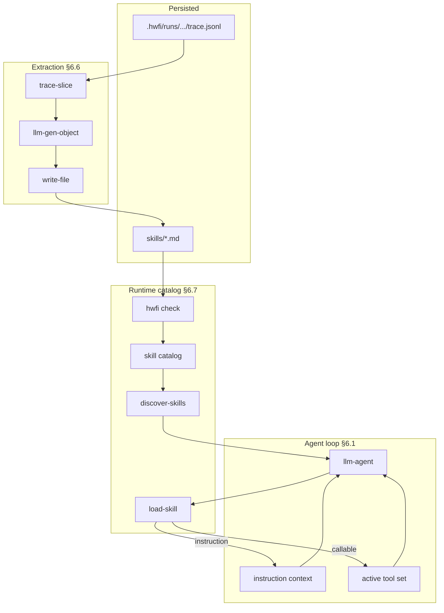

# Skills — design notes

Companion to spec §6.6–§6.7. Acceptance criteria: A36–A40 (extraction),
A45–A50 (runtime loading).

## Problem

Stage-2 goals from [idea.md](idea.md): agents should read execution traces,
learn from past runs, materialize reusable **skills**, and **load the right
skills at runtime** based on the task (Cursor-style progressive disclosure).

v1 shipped cross-run trace reading (§6.5) and skill **extraction** (§6.6).
v1.2 adds skill **discovery and loading** (§6.7).

## Design principles

1. **Two skill kinds, one catalog.** Every skill is a `skills/<name>.md`
   file with `skill:` frontmatter. **`callable`** skills are normal tool or
   workflow declarations; **`instruction`** skills are prose-only guides
   injected into agent context. One discover/load protocol covers both.

2. **Declarations, not a parallel runtime (callable).** Callable skills use
   the same parser, checker, executor, and `ToolRef` dispatch as `tools/`.
   No separate skill VM.

3. **Progressive disclosure (instruction + discover).** `discover-skills`
   returns metadata only; `load-skill` pulls full content or advertises a
   callable tool. Large skill libraries stay out of context until needed.

4. **Cross-run access is explicit.** Trace reading uses §6.5 builtins;
   skill loading uses the checked project catalog — not arbitrary files.

5. **Agent-driven extraction first (§6.6).** Mode A (trace slice → LLM →
   `write-file`) distills new skills; §6.7 is how agents consume them on
   the next run. Mode B (`extract-skill`) remains optional stub generation.

6. **Recoverable failures.** Missing skills, ineligible callables, and
   budget overflows return `{ ok = false }` — not run aborts.

## Architecture



## Skill kinds

| Kind | File body | Check time | Runtime load effect |
|------|-----------|------------|---------------------|
| `callable` (default) | Tool/workflow `step` blocks | Full `hwfi check` | Adds to agent's advertised tools |
| `instruction` | Markdown prose only | Frontmatter + no steps | Appends to agent instruction context |

### Callable example

Distilled from a trace (Mode A) or authored by hand — same as today:

```yaml
---
name: skills/fix-shell
skill:
  kind: callable
  summary: "Fix sh syntax errors using sh -n"
  tags: [shell, syntax]
---
```

Body: normal tool/workflow declaration.

### Instruction example

Author-written procedure guide — no typed declaration required:

```yaml
---
name: skills/shell-repair-guide
skill:
  kind: instruction
  summary: "sh -n repair workflow for shell scripts"
  tags: [shell]
---
# Shell repair

Always run `sh -n` before and after editing...
```

## Runtime flow (§6.7)

Recommended agent toolbox includes meta-tools alongside domain builtins:

```step
result <- builtin/llm-agent(
  system = @self#agent,
  prompt = "Fix ${inputs.target}",
  model = "smart",
  tools = [
    builtin/discover-skills,
    builtin/load-skill,
    builtin/read-file,
    builtin/edit-file,
    builtin/exec
  ],
  max_rounds = 16
)
```

Typical model sequence:

1. `discover-skills(query = "shell syntax", kinds = [], limit = 5)`
2. `load-skill(id = "skills/shell-repair-guide")` — instruction injected
3. `load-skill(id = "skills/fix-shell")` — callable advertised next round
4. Uses newly available tools to complete the task

Scripted workflows may also pre-assemble tools (§6.1.6 phase 2) or
concatenate instruction bodies into `system` without mid-loop load.

## Extraction flow (§6.6, implemented)

After a successful agent run:

```step
trace <- builtin/trace-slice(
  run_id = "...",
  qname = "workflows/fix",
  step_id = "agent",
  include_nested = true
)
draft <- tools/skill-writer(
  slice = "${trace.events}",
  kind = "tool",
  name = "skills/fix-shell"
)
_ <- builtin/write-file(path = "skills/fix-shell.md", text = "${draft.text}")
```

Author runs `hwfi check`, commits the file. On the next run the agent can
`discover-skills` / `load-skill` instead of hardcoding the skill in `tools`.

## Caching and resume

- `discover-skills` is **cacheable** (read-only catalog scan).
- `load-skill` is **non-cacheable** (mutates agent state).
- Agent checkpoint records `active-tool-ids` and `loaded-instruction-ids`
  per round (§6.1.6, §8.2.1).
- Model-call sub-keys include `advertised-tools-fingerprint` at round start.

## What not to build

- **Cross-workspace skill access** — catalog is project-scoped.
- **Skill versioning / registry** — file path is the qname; Merkle
  fingerprints handle cache invalidation (§8.1).
- **LLM inside `extract-skill`** — use Mode A for summarization.
- **Implicit meta-tool injection** — authors include `discover-skills` and
  `load-skill` explicitly in `tools` (no magic).

## Implementation map

| Task | Scope | Tests |
|------|-------|-------|
| 9.4.1–9.4.3 (done) | `skills/` loader, trace-slice, examples | A38–A39 |
| 9.4.4 (optional) | `extract-skill` stub writer | A40 |
| 9.15.1 | Catalog, `kind` frontmatter, `discover-skills` | A45–A46 |
| 9.15.2 | `load-skill` instruction path, trace events | A47 |
| 9.15.3 | `load-skill` callable path, agent checkpoint | A48–A49 |
| 9.15.4 | Runtime `tools` list on `llm-agent` | A50 |

### Module touchpoints (9.15)

| Area | Modules |
|------|---------|
| Catalog | `Parse/Project`, `Check`, new `SkillCatalog` |
| Builtins | `Builtins`, `Check/Builtins` |
| Agent loop | `Agent`, `Executor` (checkpoint, tool expansion) |
| Trace | `Trace` (`skill-discover`, `skill-load` events) |
| Checker | `Check/Decl` (instruction files, runtime `tools` list) |

## Open questions (defer unless blocking)

- **Semantic search:** v1.2 uses substring/tag match on `discover-skills`.
  Embedding-based relevance is a later enhancement.
- **Slice size caps:** `trace-slice` may gain `max_events` for extraction.
- **CLI `hwfi skill list`:** nice-to-have wrapper over the catalog; not
  required if `discover-skills` suffices.
